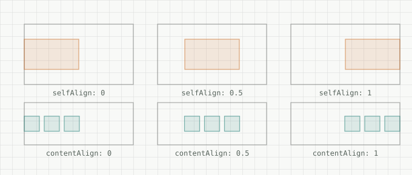
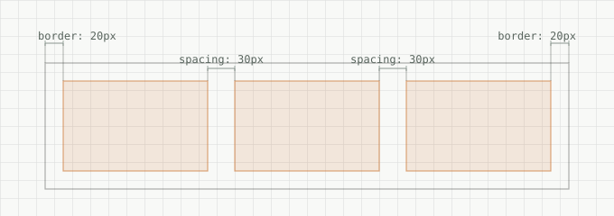
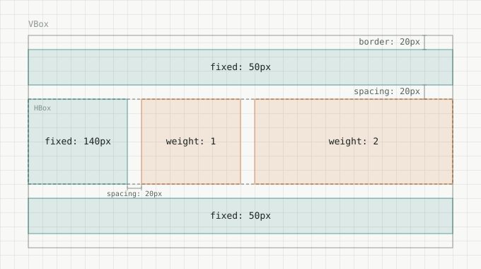
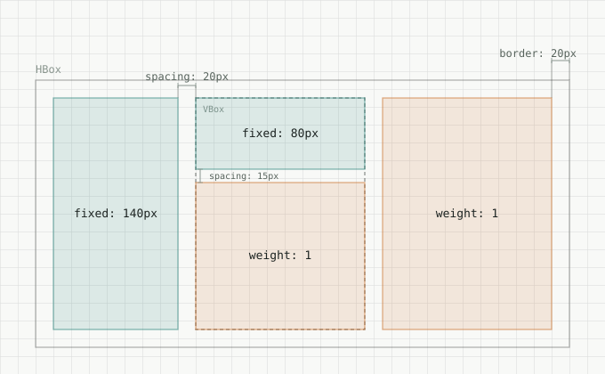

# Simple-ui
## What is this
- This is a little UI system based on [ebiten](https://github.com/hajimehoshi/ebiten), using flex elements, almost like CSS [flexbox](https://css-tricks.com/snippets/css/a-guide-to-flexbox/).
## For whom
- For those who want to add UI to their projects without learning large frameworks, while keeping development flexible.
## [Minimal start](examples/minimal/main.go)
```go
package main

import (
	"log"
	ui "simple-ui"
	"simple-ui/kit"
	"github.com/hajimehoshi/ebiten/v2"
)

type Game struct {
	root *ui.RootNode
}

func (g *Game) Update() error {
	// g.root.UpdateCursorLogic() // if you have interactive nodes like button
	return nil
}

func (g *Game) Draw(screen *ebiten.Image) {
	g.root.Draw(screen, true)
}

func (g *Game) Layout(outsideWidth, outsideHeight int) (int, int) {
	g.root.UpdateLayout(1.0 / 60.0, outsideWidth, outsideHeight)
	return outsideWidth, outsideHeight
}

func main() {
	game := &Game{}

	ebiten.SetWindowSize(512, 512)
	ebiten.SetWindowTitle("Hello simple-ui")
	ebiten.SetWindowResizingMode(ebiten.WindowResizingModeEnabled)

	game.root = ui.Root(
		kit.VBox(1),
	)

	if err := ebiten.RunGame(game); err != nil {
		log.Fatal(err)
	}
}
```
## A few words about flex and fix boxes
- It's more accurate to say that it's not the box that's flex or fixed, but the box axis that's flex or fixed. You can use FixX or FixY to fix the desired axis, but the weight works the same way regardless of orientation — it applies to whichever axis is the container's main axis, or not at all if that axis is fixed.
- If the weight is 0, it will be counted as 1.
- Depending on the container's orientation, there are two concepts: the **main axis** and the **secondary axis**. If the container is horizontal, then the X-axis is the **main axis**, and the Y-axis is the **secondary axis**.
## A few words about align
- contentAlign **(0..1)** offsets all objects in the node, and selfAlign **(0..1)** offsets the node in the parent node if there is space.
- contentAlign along the **main axis**.
- selfAlign along the **secondary axis**.

## A few words about spacing and border
- Spacing **(pixels)** - distance between sibling nodes.
- Border **(pixels)** - distance between parent node and nodes.
- Spacing and border occurs along the **main axis**.

## [Nested Vbox](examples/nested-vbox/main.go)

```go
game.root = ui.Root(
	kit.VBox(1, ui.Border(20), ui.Spacing(20),
		ui.Box(ui.FixY(50)),

		kit.HBox(1, ui.Spacing(20),
			ui.Box(ui.FixX(140)),
			ui.Box(ui.Weight(1)),
			ui.Box(ui.Weight(2)),
		),

		ui.Box(ui.FixY(50)),
	),
)
```
## [Nested Hbox](examples/nested-hbox/main.go)

```go
game.root = ui.Root(
	kit.HBox(1, ui.Border(20), ui.Spacing(20),
		ui.Box(ui.FixX(140)),

		kit.VBox(1, ui.Spacing(15),
			ui.Box(ui.FixY(80)),
			ui.Box(ui.Weight(1)),
		),

		ui.Box(ui.Weight(1)),
	),
)
```
